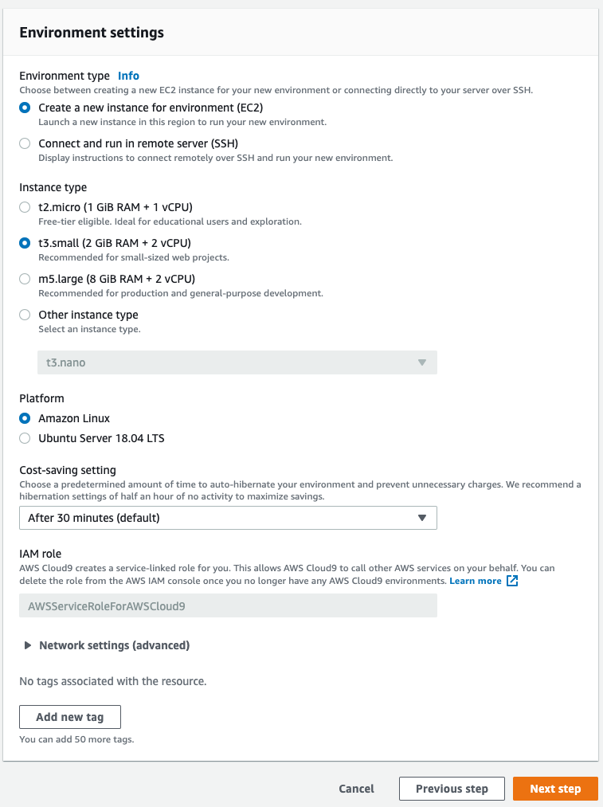

# Building modern applications that align with 12-factor methods
## Part 1 - Initial setup instructions
To complete this workshop, you will use an AWS Cloud9 environment as your IDE. In the instructions that follow, we describe the steps required to set up your AWS Cloud9 environment and get ready to implement the workshop.
Note: You must have a default VPC in the region you will run the workshop in. If you do not have a default VPC, please create one by following the instructions at [Creating a default VPC](https://docs.aws.amazon.com/vpc/latest/userguide/default-vpc.html#create-default-vpc)
1.	Log on to your AWS account using the provided information.
2.	On the AWS Console, click **Services** and type **cloud9** and then press enter.
3.	Click **Create environment**

4.	For Environment name type TollRoadGantryIDE
5.	For Description type:
`Cloud-based IDE for setting up and developing the toll gantry system`

6.	Click **Next step**
7.	On the **Configure settings** page, in the **Environment Settings** panel, select Create a new instance for environment (EC2)
8.	For **Instance type** select t3.small (2 GiB RAM + 2 vCPU)
9.	Click **Next step**

10.	Review the environment name and settings and click **Create environment** to proceed.
 	Your new AWS Cloud9 environment will be created automatically, and will take a moment to complete. When it is finished, you will see the IDE in your browser:

**Note:** Now that now that your IDE is set up, all other tasks for this workshop will be executed on the AWS Cloud9 environment. Do not run the following instructions on your local laptop - instead, run them in the AWS Cloud9 IDE.
11.	In the IDE, locate the bash terminal in the bottom panel. Run the following command to retrieve and execute a pre-prepared shell script, that will perform the following tasks:
–	Upgrade to the latest version of SAM CLI
–	Upgrade to the latest version of AWS CLI
- Install dotnet cli
`curl -s -L https://bit.ly/378xSmA | sh`
12.	We have created a bundle containing the skeleton of the system you are going to implement as part of this lab today. The bundle includes the step-by-step instructions you will follow once you reach the end of this primer document. During the bundle installation process (which you will run on the AWS Cloud9 IDE) you will be asked a series of questions, prompting you to provide data input. 
Note: Follow the questions carefully to ensure you provide the correct details.
Note: If you are using a shared account, you must ensure you use a unique project name.
`sam init --location gh:mosmabro/12-factor-dotnet-core-workshop`
13.	When the bundle customisation is complete, open the lab guide contained in the bundle to start the workshop. You can find the lab guide in the labguide folder of the project. Locate the file, right-click and choose **Preview**:

 	You’re ready to **Go Build!**
